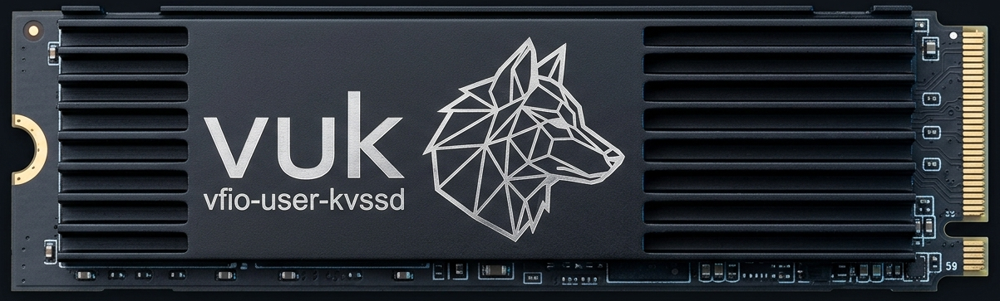

<p align="center">
  
</p>

# vfio-user-kvssd -- working notes

[](https://github.com/safl/vfio-user-kvssd/actions/workflows/ci.yml)
[](LICENSE)
[](https://ziglang.org)
[](https://github.com/safl/vfio-user-kvssd/releases)

## Why this exists

xNVMe's test setup uses a QEMU fork (`SamsungDS/qemu`, branch `for-xnvme`) to
emulate NVMe features missing from upstream QEMU. The goal is to retire that
fork and run tests against **upstream QEMU** instead, delegating the one feature
that is still fork-only to a userspace device attached over **vfio-user**.

Upstream QEMU 10.1 (Sep 2025) shipped a vfio-user *client*, so a stock QEMU can
attach a PCIe device emulated by a separate userspace process.

## What actually needs emulating

The fork's delta over upstream is small and mostly redundant now:

| feature        | status                                  |
|----------------|-----------------------------------------|
| simple-copy/copy | already upstream (TP4065)             |
| ZNS            | upstream since QEMU 6.0                  |
| FDP            | upstream since QEMU 8.0                  |
| PI             | upstream                                |
| **KV (Key-Value command set)** | **fork-only -- the reason this project exists** |

In xNVMe, `cijoe/scripts/xnvme_guest_start_nvme.py` confirms only KV is marked
"requires patches". So this device only needs to emulate the **KV command set**;
everything else uses stock `-device nvme` in upstream QEMU.

The fork's KV support is 3 small commits on `for-xnvme`:
- `691a28de` add basic kv namespace support (~375 LOC) -- the command set
- `2384fbb0` command-set independent identify ns, CNS 0x08 (~45 LOC) -- KV dep
- `e72767738` subsystem reset (~54/-21) -- unrelated nicety

## Architecture

libvfio-user emulates a *generic PCI device*. QEMU's `hw/nvme` provided a whole
NVMe controller for free; here we re-implement a minimal one. Layers:

```
upstream QEMU (>=10.1)  --vfio-user socket-->  kvssd (this process)
  guest sees a PCIe NVMe ctrl                    libvfio-user (generic PCI)
  guest nvme driver / xNVMe                       + our NVMe controller front-end
                                                  + KV command handlers (in-memory)
```

The KV logic is the *easy* part (ported near-verbatim). The bulk of the work is
the controller front-end that QEMU gave us for free.

## KV command set (what the device implements)

Opcodes (I/O): STORE 0x01, RETRIEVE 0x02, LIST 0x06, DELETE 0x10, EXIST 0x14.
Limits: key <= 16 bytes, value <= 4096 bytes. Backing store: in-memory array of
{key, kl, val, used}, linear search, grows by doubling.
Store options (cdw11.ro): dont-store-if-key-not-exists, dont-store-if-key-exists.
Status codes: 0x85 invalid val size, 0x86 invalid key size, 0x87 key not exists,
0x89 key exists. EDNEK feature (FID 0x20) controls delete-of-missing-key result.

## File layout

- `include/kvssd_nvme_spec.h` -- NVMe + KV spec subset (packed structs, opcodes,
  status, identify structs), with static asserts on wire sizes.
- `src/kv.{h,c}` -- in-memory KV ns + the 5 handlers. Decoupled from libvfio-user
  via a `kv_dma` vtable so they can be unit-tested.
- `src/nvme.{h,c}` -- the NVMe controller front-end (registers, queues, DMA).
- `src/main.c` -- libvfio-user device setup + accept/run loop.
- `subprojects/libvfio-user` -- git submodule, compiled from source.

## Build

C implementation, **Zig** build (`zig build`). Local dev uses zig at
`~/.local/zig/zig` (0.16.0).

- `zig build` -- native (glibc) device + harness.
- `zig build test` -- KV handler unit tests.
- `zig build -Dtarget=x86_64-linux-musl -Dstatic=true` -- the single **static**
  x86_64 binary, no runtime deps (verified: `ldd` -> "not a dynamic
  executable"). Add `-Doptimize=ReleaseSafe` for release.
- `tests/run_harness.sh [bin-dir]` -- starts the device, runs the client
  harness against it.

json-c (libvfio-user's only dependency) is vendored as a submodule and compiled
from source; there is no cmake, so its config headers are hand-written in
`third_party/json-c-config/` (`config.h`, `json_config.h`, umbrella `json.h`).
`third_party/musl-compat/` provides `sys/queue.h` (musl lacks it) and a
force-included `prelude.h` (musl needs `<fcntl.h>` for `loff_t` and explicit
`<string.h>`/`<stdlib.h>`; no-ops on glibc). CI: `.github/workflows/ci.yml`
downloads the zig tarball, runs unit tests + the harness (native and static),
verifies the static binary, and uploads it.

## Controller front-end plan (the hard part)

1. BAR0 register block: CAP/VS/CC/CSTS/AQA/ASQ/ACQ + doorbells. [done: regs +
   CC.EN/CSTS.RDY handshake]
2. Admin queue engine: on CC.EN, arm admin SQ/CQ from AQA/ASQ/ACQ. Doorbell
   write -> fetch SQEs via DMA, dispatch, post CQE, advance phase, raise IRQ.
3. Admin commands needed to enumerate+attach a KV ns:
   - Identify: CNS 01 (ctrl), 02 (active ns list), 03 (ns desc -> CSI=KV),
     05 (csi ns -> KV id), 06 (csi ctrl), 08 (cmd-set independent), 1c (I/O
     command set data structure -- the tricky negotiation bit).
   - Set/Get Features: Number of Queues (07), EDNEK (20).
   - Create/Delete IO CQ (05/04) and SQ (01/00). Async Event (0c) left
     outstanding. Get Log Page (02) stubbed.
4. IO queue doorbell -> dispatch KV opcodes -> `nvme_io_kv` -> handlers.
5. DMA: PRP1/PRP2 today (KV values + identify are <= 2 pages). PRP lists / SGL
   are TODO. `nvme_prp_xfer` for command data, contiguous GPA xfer for queues.
6. Interrupts: none wired yet. MSI-X (eventfd-backed) needed for a real guest;
   a polling client does not need interrupts. Do NOT call vfu_irq_trigger (or
   any server-to-client command) from a synchronous region-access callback on a
   single socket -- it collides with the client's in-flight request and resets
   the connection.

### DMA gotcha (important)

For data movement use `vfu_sgl_get` -> memcpy the returned iovecs ->
`vfu_sgl_put` (local access to the mmap'd region). Do NOT use
`vfu_sgl_read`/`vfu_sgl_write`: those issue `VFIO_USER_DMA_READ/WRITE`
*socket commands* back to the client, which deadlock/reset when called from a
synchronous region-access callback (and only support a single sg entry). This
requires a `dma_unregister` callback on `vfu_setup_device_dma` so regions are
mmap'd locally.

### Build note

`zig cc` enables UBSan in Debug; libvfio-user's C has benign null-pointer
arithmetic (e.g. logging an IOVA-0 region), so its sources are compiled with
`-fno-sanitize=undefined` (our own code keeps UBSan).

### Command-set negotiation (CAP.CSS / CC.CSS / Identify 1Ch) -- the fiddly bit

Making a guest attach a KV namespace requires: CAP.CSS advertises multiple I/O
command sets (bit set), host selects via CC.CSS=110b, Identify CNS 1Ch returns
supported command-set combinations, Set Features 19h (Command Set Profile)
selects one, and per-ns CSI is reported in CNS 03h (descriptor) and CNS 05h.
This is exactly what QEMU's hw/nvme does generically. Implement carefully and
validate against the real Linux nvme driver under QEMU; cross-check against the
fork's `nvme_identify_*` / `nvme_cmd_set` behavior.

## Bring-up / testing

Local validation uses the client harness (`tests/run_harness.sh`) -- no QEMU
needed. It exercises the full path: enable controller, Identify (ctrl, cs-ind-ns,
io-cmd-set), create IO queues, KV store/retrieve. This is the primary regression
test until a QEMU >=10.1 environment is available.

### Real guest under QEMU >= 10.1 (task #15)

Encoded as a cijoe task so it runs on GHA (modeled on the cijoe/qemu setups in
xnvme, bty, nosi). Rather than building QEMU from source, the job runs inside
the **nosi `ubuntu-2604-docker`** image, which ships QEMU 10.2 (vfio-user
client) + cijoe and is built to launch qemu guests under nested KVM on GHA:

- `cijoe/configs/qemu-kvssd.toml` -- SSH transport (guest), system QEMU
  (`qemu-system-x86_64`), guest, `[kvssd]` device.
- `cijoe/scripts/vfu_kvssd_start.py` -- starts the device, then boots the guest
  with a shareable memfd backend + `-device vfio-user-pci` (via
  `Guest.start(extra_args=...)`, the same hook xNVMe uses to inject `-device nvme`).
- `cijoe/tasks/test-kvssd.yaml` -- build kvssd (zig) -> start device+guest ->
  wait for SSH -> build xNVMe in-guest -> run KV tests
  (`kvs enum/idfy-ns`, `xnvme_tests_kvs kvs_io /dev/ng0n1 --dev-nsid 1`) ->
  poweroff. `cijoe --integrity-check` passes.
- `.github/workflows/qemu-kvssd.yml` -- runs in the nosi container
  (`--privileged` for /dev/kvm), installs Zig, stages the guest `boot.img`
  (Debian cloud) + a cloud-init seed (root SSH), runs the task, uploads the
  cijoe report.

cijoe gotcha: `cijoe.run()` (no transport) targets the *first* `[cijoe.transport.*]`
entry, so host-side steps must use `transport: initiator` (local); only guest
steps use `ssh`. The device/guest are staged directly (no `qemu.build` /
`guest_initialize`).

Run locally (needs QEMU >= 10.1 + KVM):
`cd cijoe && cijoe tasks/test-kvssd.yaml -c configs/qemu-kvssd.toml`

This dev box is Debian trixie with QEMU 10.0.8 (no vfio-user client), so the
run itself must happen on GHA or a Fedora 44 / Ubuntu 26.04 / QEMU >=10.1 host.
The underlying QEMU invocation the cijoe script assembles:

```
# 1. Start the device (static binary, no runtime deps):
./vfu_kvssd -s /tmp/vfu_kvssd.sock

# 2. Boot a guest, attaching the device as a vfio-user client. The guest RAM
#    MUST be a shared memory-backend so the device can mmap it for DMA (the
#    same reason the harness used a shared memfd):
qemu-system-x86_64 \
  -machine q35,accel=kvm,memory-backend=mem \
  -object memory-backend-memfd,id=mem,size=4G,share=on \
  -cpu host -smp 4 \
  <your guest kernel/disk options> \
  -device vfio-user-pci,socket=/tmp/vfu_kvssd.sock

# 3. In the guest, the KV namespace shows up as a generic char device
#    (the kernel does not attach KV as a block device):
ls /dev/ng*                       # e.g. /dev/ng0n1
# 4. Run xNVMe KV tests through the char device (tests/kvs.c,
#    python/tests/test_key_value.py), e.g.:
xnvme_tests_kvs kv_store /dev/ng0n1
```

Known follow-ups to validate under a real guest kernel: MSI-X interrupt
*delivery* (the capability + trigger are implemented; the harness polls), and
whether the kernel enumerates the KV ns purely from the active-list + CSI
descriptor + cs-independent identify (expected, per the SamsungDS/qemu design).

## QEMU 10.1 distro matrix (vfio-user client needs >= 10.1)

- Fedora 44: 10.2  -> yes
- Ubuntu 26.04: 10.2 -> yes
- Ubuntu 24.04: 8.2 -> no
- Debian 13: 10.0.8 -> no (just misses it)

## Status (2026-05-28)

Scaffold builds/links/runs with Zig. KV spec + handlers ported, wired, and
unit-tested (`zig build test`, no QEMU needed). Queue engine implemented: admin
+ IO SQ/CQ rings, doorbell-driven SQE fetch / CQE post, CC.EN/CSTS handshake,
PRP + contiguous DMA, Identify (ctrl / active-list / ns-desc CSI / cs-ns KV),
Set/Get Features (num queues, EDNEK), Create/Delete IO CQ/SQ, KV IO dispatch.

The device is validated end-to-end by the local client harness
(`vfu_kvssd_harness`, no QEMU): enable -> Identify (ctrl / cs-ind-ns nstat /
io-cmd-set NVM) -> MSI-X capability present -> create IO CQ/SQ -> KV
store/retrieve, all over a real vfio-user socket. Build artifacts: `vfu_kvssd`
(device) and `vfu_kvssd_harness`.

Done: queue engine, identify surface (incl. command-set bits + cs-independent
identify), MSI-X capability + completion trigger, static musl single binary, CI.
PRP lists are intentionally omitted: MDTS=1 caps transfers at 2 pages.

Remaining: the QEMU >=10.1 guest bring-up + xNVMe KV tests (#15), which needs a
newer QEMU than this box has -- see below.
